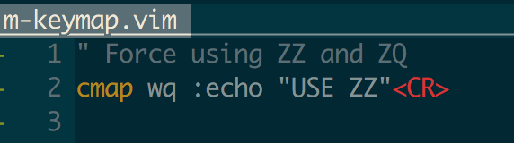

`TLDR: cmap wq :echo "USE ZZ" <CR>`

Only people who doesn't know how to use ":wq" are still in vim, so this micro tip is for those who finally did it!

I really like using `ZZ` to save and close vim, but I'm so used to using :wq
and :q! Its super hard to force myself changing this habit. To alleviate this,
and force myself using (for me more elegant solution `ZZ/ZQ`) I remapped my vimrc
to look like this: 

`cmap wq :echo "USE ZZ" <CR>`

### Motivation behind it?

I usually do this action with my left hand(shift included), which force me
Ito use my left pinky a lot (1 + 2 x in a row is a lot in my book), and I
I don't find this particularly enjoyable, especially if this is something I
I use multiple times per day if you anything like me and closing/opening vim a
lot `:q!` You will love this tip

ZZ
